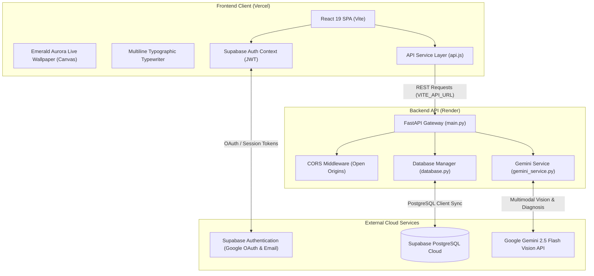
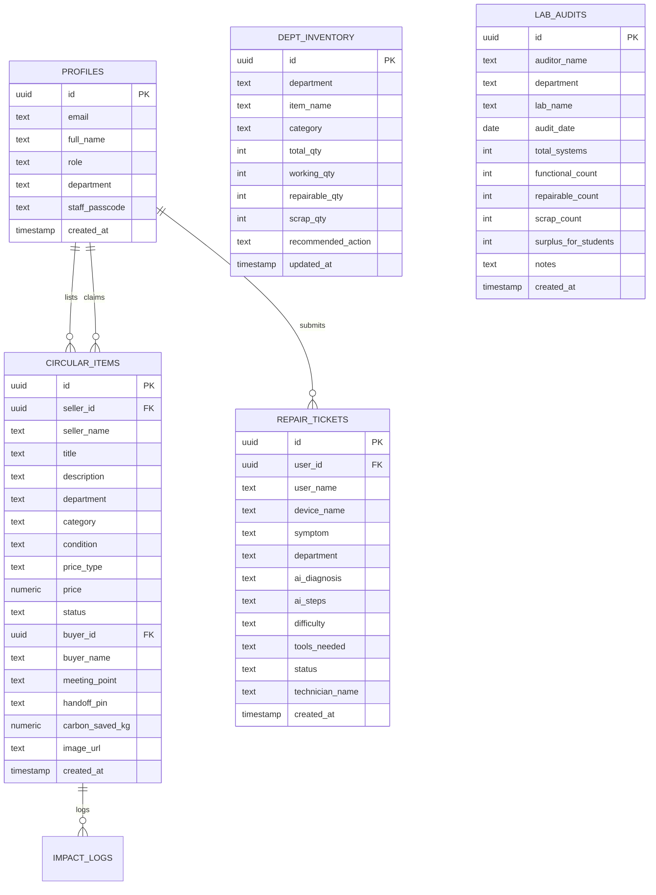

# EcoLoop — Complete Knowledge Transfer (KT) & Architecture Document

---

## 1. Executive Summary & Project Purpose

**EcoLoop** is a full-stack, AI-powered circular electronics economy and e-waste mitigation platform custom-engineered for **NSS College of Engineering (NSSCE), Palakkad**. 

### The Problem
Universities and engineering colleges generate substantial electronic waste each semester — functional microcontrollers, testing kits, sensor modules, display units, power supplies, and lab peripherals that are abandoned or scrapped after final-year projects, syllabus updates, or minor component failures. At the same time, junior students frequently re-purchase identical components at full retail price, while unrepairable boards risk ending up in regional landfills.

### The EcoLoop Solution
EcoLoop closes this campus lifecycle loop through three core mechanisms:
1. **Peer-to-Peer Circular Marketplace**: Enables students and labs to list, gift, or trade functioning electronics within the 5 engineering branches using a secure 4-digit PIN handoff verification protocol.
2. **AI Waste Classifier & Triage**: Uses Google Gemini 2.5 Flash Vision to inspect hardware photos, categorize materials, compute carbon diversion metrics (\(kg\text{ CO}_2\)), identify toxicity hazards, and route components strictly to valid campus pathways (Marketplace Reuse, Repair Clinic, or Department Lab Salvage).
3. **Repair Before Replace Clinic**: Provides automated diagnostic checklists, root-cause analyses, and spare-part pricing estimates, allowing students and department lab staff to restore hardware instead of replacing it.

---

## 2. Technical Stack & Technology Choices

| Layer | Technology | Version | Rationale & Responsibility |
| :--- | :--- | :--- | :--- |
| **Frontend Framework** | React | `^19.2.8` | Component-driven SPA, fast virtual DOM, hooks-driven state. |
| **Build Tool & Bundler** | Vite | `^8.3.0` | Sub-second HMR in dev, optimized Rollup-based production builds. |
| **Styling & Design System** | Tailwind CSS (v4) | `^4.3.3` | Utility-first styling with `@theme` token definitions, custom cursors, and responsive layouts. |
| **Typography System** | Google Fonts | Web | Tri-tier hierarchy: **JetBrains Mono** (Tech/terminal), **Geist Sans** (Hero Display & Body), and **Instrument Serif** (Editorial Accent). |
| **Iconography** | Lucide React | `^1.48.0` | Consistent, accessible SVG icons. |
| **Visual Graphics** | Custom Canvas / WebGL | Vanilla JS | Mathematical continuous Emerald Aurora bloom live wallpaper rendered at 60 FPS on `<canvas>`. |
| **Data Visualizations** | Recharts | `^3.10.1` | Departmental inventory and audit analytics charts. |
| **Backend Framework** | FastAPI (Python) | `>=0.115.0` | Asynchronous ASGI REST API, high throughput, auto-generated OpenAPI documentation. |
| **ASGI Web Server** | Uvicorn | `>=0.30.0` | High-performance asynchronous Python server implementation. |
| **Data Validation** | Pydantic (v2) | `>=2.8.0` | Strict schema validation for all API inputs and responses. |
| **Database & Auth** | Supabase | `v2.8.0+` | Cloud-hosted PostgreSQL with Row Level Security (RLS), Realtime replication, and JWT-based authentication. |
| **AI Vision & Diagnostics**| Google Gemini 2.5 Flash | `google-genai 2.20+` | Multimodal component inspection and hardware diagnostic troubleshooting. |
| **Cloud Hosting (Web)** | Vercel | Global Edge | Zero-configuration React SPA deployment, automated CI/CD from GitHub, edge caching. |
| **Cloud Hosting (API)** | Render | Python 3.11 | Managed containerized web service hosting the FastAPI backend with health monitoring. |

---

## 3. High-Level System Architecture



---

## 4. Key Functional Modules

### 4.1. Landing & Authentication (`LoginScreen.jsx`)
* **Visuals**: Fullscreen continuous Emerald Aurora blooms animating over an obsidian (`#121212`) backdrop.
* **Typographic Canvas**: Sequential multiline typewriter writing directly on the wallpaper (no enclosing cards/borders):
  * **Line 1 (Tech Kicker)**: `JetBrains Mono` • `text-xs/sm uppercase tracking-[0.25em]` in `#3ECF8E` emerald.
  * **Line 2 (Hero Impact)**: `Geist Sans` • `text-3xl to 5xl font-black` in `#EDEDED` white.
  * **Line 3 (Editorial Accent)**: `Instrument Serif` (italic) • `text-2xl to 4xl` in soft mint.
  * **Line 4 (Mission Narrative)**: `Geist Regular` • `text-xs to base` in muted zinc.
* **Institution Affiliation**: Clean, subtle `NSS College of Engineering, Palakkad` text anchored at the bottom center.
* **Auth Support**: Google OAuth single-sign-on + email/password login and registration.
* **Role Verification**: Students register directly. Faculty/Lab Staff require a department verification passcode (`STAFF_SECRET_KEY`) to prevent unauthorized role escalation.

### 4.2. Consolidated Campus Hub (`StudentDashboard.jsx`)
* **Consolidated Master Card**: Unifies the "My Campus Circular Hub" title, "+ List Electronics for Sale / Free" button, and 4 nested metrics:
  * **Total Listed**: Active campus listings posted by the user.
  * **Pending Meetups**: Hardware claimed with unverified handoff PINs.
  * **Sold / Handed Off**: Completed handoffs successfully verified.
  * **Claimed by Me**: Items reserved by the student awaiting peer pickup.
* **Streamlined UI**: Removed redundant carbon mitigated cards to keep the interface focused and clutter-free.

### 4.3. Circular Electronics Marketplace (`MarketplaceCircular.jsx`)
* **Branch Filtering**: Filter listings across the 5 engineering departments:
  * Computer Science and Engineering (CSE)
  * Mechanical Engineering (ME)
  * Civil Engineering (CE)
  * Electrical and Electronics Engineering (EEE)
  * Instrumentation and Control Engineering (ICE)
* **Pricing Models**: Free Campus Gifts (₹0) or student-subsidized pricing.
* **Cryptographic 4-Digit PIN Protocol**:
  1. Student A lists an Arduino board.
  2. Student B claims the board and types a meeting point (e.g. *Mech Block Foyer*).
  3. The system generates a cryptographically secure 4-digit PIN visible **only to Student B**.
  4. Both meet in person. Student B inspects the board and shares the PIN.
  5. Student A enters the PIN into the app, which verifies and marks the item `completed`, preventing scam listings or phantom claims.

### 4.4. AI Waste Classifier (`AIWasteClassifier.jsx` & `gemini_service.py`)
* **Vision Model**: Google Gemini 2.5 Flash parses uploaded photos of circuit boards, broken mice, damaged displays, and power supplies.
* **Extracted Schema**:
  * `category`: E-Waste, Metal, Plastic, Hazardous, etc.
  * `item_name`: Specific identified model/component.
  * `materials_detected`: E.g., Copper, FR4 fiberglass, solder, ABS plastic.
  * `hazard_level` & `hazard_reason`: E.g., Lead solder, punctured Li-ion cells.
  * `carbon_savings_if_diverted_kg`: Estimated carbon offset.
  * `recommended_action`: Strictly mapped to campus options (`Reuse`, `Repair`, `Component Harvesting`).
* **Strict Campus Grounding**: Explicitly instructed **never** to mention non-existent external collection bins or municipal bulk pickups. All components route exclusively to:
  * **Marketplace Reuse**: Listing for peer projects.
  * **Repair Clinic**: Submitting for troubleshooting.
  * **Department Lab Salvage**: Direct handover to hardware lab staff for harvesting reusable ICs and passives.
* **One-Click Publishing**: Pre-fills marketplace listing or repair tickets directly from the scan results with modal confirmation.

### 4.5. Repair Before Replace Clinic (`RepairPlatform.jsx`)
* **Automated Diagnosis**: Diagnoses hardware issues by device name, category, and symptoms.
* **Step-by-Step Guides**: Generates inspection steps, testing procedures, required tools (e.g. *Phillips #00, Multimeter, IPA*), and replacement component cost estimates in Indian Rupees (₹).
* **Ticket Tracking**: Enables students to log tickets and view personal submitted repair tickets.

### 4.6. Department Inventory & Lab Audit Triage (`DeptInventoryTriage.jsx` & `LabStaffDashboard.jsx`)
* **Inventory Triage**: Tracks hardware inventories across all 5 engineering departments, categorizing assets into:
  * Working Quantity
  * Repairable Quantity
  * Scrap Quantity
* **Lab Audits**: Enables lab technicians to submit equipment audits and calculate campus surplus eligible for student distribution.

---

## 5. Database Schema & Entities

The platform uses **Supabase PostgreSQL** as its primary cloud data store, with a local SQLite mirror for offline development.



---

## 6. Deployment & Cloud Infrastructure

### 6.1. Backend Deployment (Render)
* **Service Type**: Web Service (Python 3)
* **Repository**: `ro120212/EcoLoop`
* **Root Directory**: `backend`
* **Build Command**: `pip install -r requirements.txt`
* **Start Command**: `uvicorn main:app --host 0.0.0.0 --port $PORT`
* **Live Endpoint**: `https://ecoloop-s148.onrender.com`
* **Health Check**: `https://ecoloop-s148.onrender.com/health` (supports both `GET` and `HEAD` methods).
* **Required Environment Variables**:
  ```ini
  PYTHON_VERSION=3.11.9
  SUPABASE_URL=https://cxhqjmrxtlfrthuboaij.supabase.co
  SUPABASE_ANON_KEY=eyJhbGciOi...
  SUPABASE_SERVICE_ROLE_KEY=eyJhbGciOi...
  GEMINI_API_KEY=AIzaSy...
  ```

### 6.2. Frontend Deployment (Vercel)
* **Framework**: Vite
* **Root Directory**: `frontend` (also supported at `./` via root `vercel.json`)
* **Build Command**: `npm run build`
* **Output Directory**: `dist` (or `frontend/dist` if building from root)
* **SPA Routing**: Handled via `vercel.json` rewrites:
  ```json
  {
    "rewrites": [
      { "source": "/(.*)", "destination": "/index.html" }
    ]
  }
  ```
* **Required Environment Variables**:
  ```ini
  VITE_API_URL=https://ecoloop-s148.onrender.com
  VITE_SUPABASE_URL=https://cxhqjmrxtlfrthuboaij.supabase.co
  VITE_SUPABASE_ANON_KEY=eyJhbGciOi...
  ```

### 6.3. Supabase Redirect URL Configuration
In **Supabase Dashboard** > **Authentication** > **URL Configuration**:
* **Site URL**: `https://<your-vercel-domain>.vercel.app`
* **Redirect URLs**:
  * `https://<your-vercel-domain>.vercel.app/**`
  * `http://localhost:5173/**` *(for local development)*

---

## 7. Local Development Guide

### Prerequisites
* **Node.js**: v18.0 or higher
* **Python**: v3.11 or higher
* **Git**

### Running the Backend Locally
```bash
cd backend
python -m venv .venv
# Windows:
.venv\Scripts\activate
# macOS/Linux:
# source .venv/bin/activate

pip install -r requirements.txt
uvicorn main:app --reload --host 127.0.0.1 --port 8000
```
Backend will be live at `http://127.0.0.1:8000` with Swagger docs at `http://127.0.0.1:8000/docs`.

### Running the Frontend Locally
```bash
cd frontend
npm install
npm run dev
```
Frontend will be live at `http://localhost:5173`. Vite automatically proxies `/api` requests to `http://127.0.0.1:8000`.

---

## 8. Operational Maintenance & Free-Tier Optimization

### 8.1. Managing Render Inactivity (Cold Starts)
* **Behavior**: Render's free tier spins down after **15 minutes of zero traffic**. The first wake-up request takes ~30–45 seconds.
* **Keep-Alive Solution**: Create a free recurring monitor on [cron-job.org](https://cron-job.org) or [UptimeRobot](https://uptimerobot.com) to ping `https://ecoloop-s148.onrender.com/health` every 10 minutes. This keeps the backend warm 24/7.
* **Presentation Protocol**: Before demonstrating the application to evaluators or faculty, visit the health endpoint 1 minute prior to prime the server.

### 8.2. Rate Limits & Quotas
* **Gemini Vision**: Google AI Studio provides 15 Requests Per Minute (RPM) on free API keys. The backend caches image hashes via SHA-256 in `db` to return instant 0ms responses on duplicate scans.
* **Supabase**: Up to 50,000 monthly active users and 500 MB storage on the free plan, which exceeds the requirements of an engineering college campus.

---

## 9. Summary of Key Files

```
EcoLoop/
├── backend/
│   ├── main.py               # FastAPI routes, CORS, Pydantic schemas, health checks
│   ├── database.py           # DatabaseManager for Supabase sync & SQLite fallback
│   ├── gemini_service.py     # Gemini 2.5 Flash Vision classification & diagnostics
│   ├── requirements.txt      # Python dependencies
│   ├── Procfile              # Render process definition
│   └── runtime.txt           # Python 3.11.9 runtime definition
├── frontend/
│   ├── src/
│   │   ├── components/
│   │   │   ├── LoginScreen.jsx          # 2-column layout, multiline typewriter, auth forms
│   │   │   ├── LiveWallpaper.jsx        # Canvas-based 60 FPS emerald aurora bloom
│   │   │   ├── EcoLoopLogo.jsx          # Pure transparent SVG logo
│   │   │   ├── StudentDashboard.jsx     # Consolidated circular hub master card
│   │   │   ├── MarketplaceCircular.jsx  # P2P exchange with 4-digit PIN verification
│   │   │   ├── AIWasteClassifier.jsx    # Gemini vision classification & modal routing
│   │   │   ├── RepairPlatform.jsx       # Diagnostic troubleshooter & ticket manager
│   │   │   └── DeptInventoryTriage.jsx  # 5-branch hardware inventory audit
│   │   ├── services/
│   │   │   ├── api.js                   # REST client with dynamic API_BASE routing
│   │   │   ├── authService.js           # Supabase auth wrapper & role management
│   │   │   └── supabaseClient.js        # Supabase client with env overrides
│   │   ├── index.css                    # Tailwind v4 theme, fonts, custom cursors
│   │   └── App.jsx                      # App root, role routing, navigation
│   ├── index.html                       # Google fonts link (Geist, Instrument Serif, JetBrains Mono)
│   ├── package.json                     # Frontend dependencies & build scripts
│   ├── vite.config.js                   # Vite configuration with local proxy
│   └── vercel.json                      # Vercel SPA rewrites & output directory
├── package.json                         # Root package.json for monorepo build delegation
├── vercel.json                          # Root Vercel deployment configuration
├── render.yaml                          # Render Blueprint infrastructure definition
├── supabase_schema.sql                  # Production SQL schema & RLS policies
└── README.md                            # High-level repository readme
```
